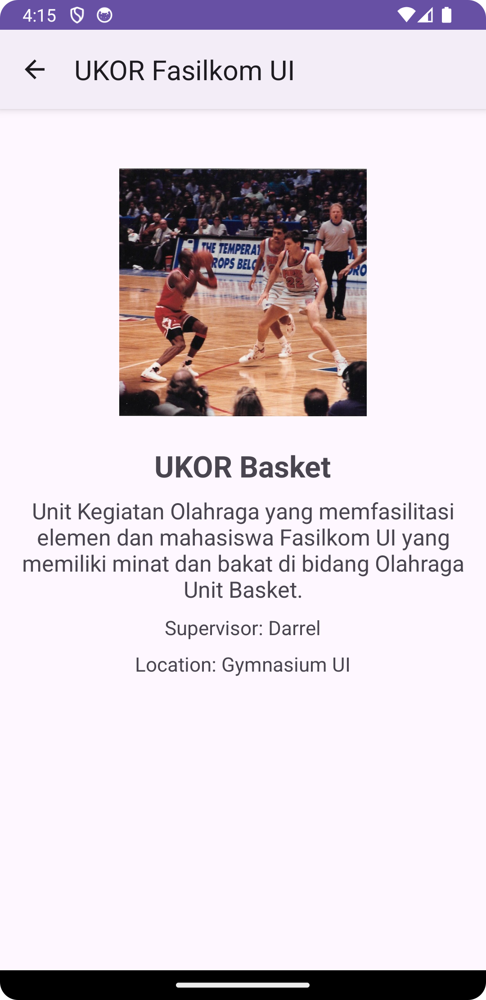

# Sport Activities Application

## Description
The Sport Activities Application is an Android app developed as the culminating project for the "Belajar Membuat Aplikasi Android untuk Pemula" course by Dicoding. Built with Kotlin, it enables users to view sports activities offered by the Faculty of Computer Science UI. Users can access detailed information about each activity, including descriptions, practice locations, and supervisors.

**Note** : For learning purposes, not for plagiarism, following Dicoding's rules.

## Features
- **List of Sport Activities**: Explore all available sports activities offered.
- **Activity Detail**: Access comprehensive information about each activity, including descriptions, practice locations, and supervisors.
- **User Profiles**: Discover brief introductions about the developers behind the application.

## Preview Application

| Home | Detail | Profile |
| --- | --- | --- |
|  |  |  |